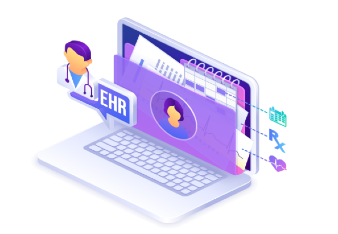

<h1 align="center">
  Primary Care Clinic Application 
</h1>

<h2 align="center">
  An Electronic Health Record (EHR) designed to optimize patient management for clinicians working in primary care clinics
</h2>

<p align="center">
  
</p>

<br>

## What will the application do and who will use it? ###
The application serves as an EHR system designed for primary care clinics, providing an efficient way to manage all patients currently registered at a clinic. It displays a comprehensive, alphabetically sorted list of patients by last and first name, and allows clinicians to add new patient profiles, update existing information, or remove patients from the system. Each patient record allows for the tracking of both demographic and clinical information, including first and last name, date of birth (DOB), age, personal health number (PHN), allergies, medications, and medical conditions. In addition, the application allows clinicinas to create, edit, and delete clinical notes for patient visits, capturing key details such as the reason for the visit, visit summary, healthcare provider, and visit date. Clinicians can also view the full clinical history for any patient.

The primary care clinic application is designed to be used by medical professionals and administrative staff, including physicians, clinical pharmacists, nurses, and medical office assistants, to streamline patient management and ensure accurate record-keeping for the improved delivery of patient care.

<br>

## Why is this project of interest to you? ###
This project interests me because I have a background in the healthcare industry as a pharmacist and have worked at a variety of healthcare settings, including community pharmacies, hospitals, and ambulatory care clinics. I've worked with different EHR systems and understand the challenges healthcare professionals face when managing patient records. By building an EHR application, I can combine my healthcare knowledge with my technical skills to create a more efficient and user-friendly system for clinicians. It also supports my goal of using technology to streamline healthcare processes and improve overall efficiency.

<br>

## Overview of Features
- Loading and quitting the application
    - Upon starting the application, users can choose to load clinic data from file or start a new file and create a new clinic (new name)
    - Upon quitting the application, users can choose to save their clinic data to file or quit without saving
- Clinic management
    - Users can choose to rename the clinic at anytime
- Patient record management
    - Users can view a list of all patient records at the clinic
        - Sorted alphabetically by last name and then first name
    - Users can add new patient records to the clinic
        - Need to specify each patient's first and last name, DOB, age, PHN, allergies, current medications, and medication conditions
    - Users can remove an existing patient record from the system
    - Users can view a specific patient's profile by double clicking their information (in list view)
    - Users can update information in a patient's record
        - Can edit the patient's first and last name, DOB, age, PHN, add/remove allergies, add/remove medications, and add/remove medication conditions
- Clinical note management
    - Users can view the history of all clinical notes for a specific patient (ordered in reverse chronological order)
    - Users can add new clinical notes to a patient's record
        - Can include details such as the reason for visit (title), visit details (body), name of the healthcare provider seen
        - The visit date is automatically calculated based on the current date
    - Users can update a clinical note from a patient's record
        - Can edit the title, body, and healthcare provider seen
    - Users can remove a clinical note from a patient's record

<br>

## Specific Features
### Loading screen
- A visually engaging loading screen that dynamically appears during application startup


<br>

### Load the clinic from file or create a new clinic
- The user is given the option to either:
    - Load existing clinic data from a saved file 
    - Start a new file and add a new name for the clinic


<br>

### Rename the clinic
- The user can choose to rename the clinic

Renaming the clinic from "MedCare Clinic" to "CarePlus Clinic"


<br>

### View all patient records
- All patient records are displayed in a list view sorted alphabetically by last name then first name
- The user can double click a patient from the list to view their full profile


<br>

### View a specific patient record
- The user can view and edit patient details including:
    - First name
    - Last name
    - Date of birth (DOB)
    - Age
    - Personal Health Number (PHN)
    - Allergies (can add and remove)
    - Medications (can add and remove)
    - Medical conditions (can add and remove)
- The user can also remove a patient record entirely from the clinic

User profile for Mya Cornell


Changing the first name from "Mya" to "Mira"


Adding a clindamycin allergy


Removing a codeine allergy


<br>

### Add a new patient record:
- The user can add a new patient record with the following details:
    - First name
    - Last name
    - Date of birth (DOB)
    - Age
    - Personal Health Number (PHN)
    - Allergies (can add and remove multiple)
    - Medications (can add and remove multiple)
    - Medical conditions (can add and remove multiple)

Creating a new patient record


Creating a new patient record with sample patient data


Adding an allergy


Adding the patient to the clinic


New patient profile


<br>


### View and manage clinical notes 
- All past clinical notes for the patient are displayed in reverse chronological order (most recent first)
- The user can add a new clinical note with the following information:
    - Visit title (reason for visit)
    - Healthcare provider name
    - Visit details (note body)
    - Date of visit (automatically assigned as the current date)
- The user can edit the following for existing clinical notes:
    - Visit title
    - Visit body
    - Healthcare provider
- The user can remove a clinical note from a patient’s record

Creating a new clinical note


Creating a new clinical note with sample clinical information


Changing the title of a clinical note


Removing a clinical note


<br>
 
### Save and quit the clinic application
- Upon quitting the application, yhe user is given the option to either:
    - Save the clinic data before quitting
    - Quit without saving


<br>

## Tech Stack

### Frontend
- Graphical User Interface (GUI): Developed with Java Swing to provide a responsive and user-friendly experience
- Command-Line Interface (CLI): Implemented in Java for lightweight, text-based interactions
  
### Backend
- Core application logic written in Java
- Unit testing conducted using JUnit Jupiter to ensure code reliability and maintainability


<br>

## User Interface Options
To maximize usability and accessibility, I implemented two distinct user interfaces that share the same backend logic. Both interfaces interact with the same model and persistence layers, ensuring consistency in behavior regardless of how the application is accessed. 

### Command-Line Interface (CLI)
- Found in Main.java in the cli folder (main/ui/cli/Main.java)
- Offers a text-based interface ideal for terminal-based workflows
- Provides simple menu-driven navigation with input validation to guide users through interactions
  
### Graphical User Interface (GUI)
- Found in MainUI.java in the gui folder (main/ui/gui/MainUI.java)
- Provides a visual, user-friendly experience with clearly structured panels and a navigation bar that enables smooth switching between screens

<br>

## Object-Oriented Programming (OOP) Principles
OOP principles are fundamental to the architecture and design of my application. Core OOP principles such as modularity, reusability, the single responsibility principle (SRP), abstraction, encapsulation, inheritance, and polymorphism are applied throughout the application to ensure clean separation of models, reusability, and data integrity.

### Modularity and reusability
- Each major concept in my clinic system is modeled as its own class, making the system modular for maintability and reusability
- These include:
    - Clinic - manages and stores patients
    - Patient - stores individual patient data and clinical notes
    - ClinicalNote - holds individual clinical note entries for patients
    - Date - stores date-related logic

### Single Responsibility Principle (SRP)
- Each class has one main well-defined responsibility
- Helps to improve the scalability of the application, allowing new features to be added with minimal disruption to the existing codebase

### Abstraction and encapsulation
- Abstraction is employed to hide implementation details and expose only relevant functionality
- Encapsulation is achieved by designing each model class with private fields and public getter/setter methods, to ensure that an object’s internal state cannot be accessed or modified directly from outside the class, reducing the likelihood of bugs and unintended behavior


### Inheritance and polymorphism
- Writable is an interface that is implemented by model classes like Clinic, Patient, and Clinical note
- This allows polymorphic behavior when writing to JSON
  
<br>

## JSON-Based Data Persistance
To enable users to save and reload their clinic data between sessions, I implemented data persistence using custom JSON-based file readers and writers. This system allows users to choose between starting a new session or loading a previously saved clinic. It also ensures robust error handling for missing files, thus improving reliability.

### Writing data
- JsonWriter.java is responsible for converting the current state of the Clinic object into a well-structured JSON file, which includes all patients and their associated clinical notes
- This allows for easy storage, backup, and transferability of clinic data
- 
### Reading data
- JsonReader.java reads a previously saved JSON file
- It reconstructs the complete clinic state by creating new Clinic, Patient, and ClinicalNote objects based on the serialized data

<br>

## Unit Testing (JUnit Jupiter)
- Thorough testing was critical to ensuring the reliability and robustness of the application
- I used JUnit 5 (Jupiter) to write unit tests for every class and method in the model and persistence packages including:
    - Models:
        - TestClinic.java 
        - TestPatient.java
        - TestClinicalNote.java
        - TestData.java
    - Persistance:
        - JsonReaderTest.java
        - JsonTest.java
        - JsonWriterTest.java
- Every branch and conditional pathways were tested to ensure proper handling under all scenarios, resulting in 100% test coverage

<br>

## Event Log
The application automatically generates a detailed event log that tracks all significant actions taken during a session. This includes changes to clinic information, additions and updates to patient records, and any modifications to clinical notes. Each log entry includes a precise timestamp and a clear description of the action performed, providing a transparent and traceable history of user interactions within the system. This feature supports auditing, debugging, and better accountability for patient data management.

Sample event log record:
- Fri Mar 28 01:54:35 PDT 2025 - Clinic name set to Medicare Plus
- Fri Mar 28 01:55:26 PDT 2025 - Patient Mya Cornell added to the clinic
- Fri Mar 28 01:56:04 PDT 2025 - Patient Ashley Davis added to the clinic
- Fri Mar 28 01:56:36 PDT 2025 - Patient Amira Garcia added to the clinic
- Fri Mar 28 01:56:55 PDT 2025 - Set first name of patient Amira Garcia to Freya
- Fri Mar 28 01:57:00 PDT 2025 - Set last name of patient Freya Garcia to Kwon
- Fri Mar 28 01:57:19 PDT 2025 - Set date of birth of patient Freya Kwon to 10/27/1987
- Fri Mar 28 01:57:23 PDT 2025 - Set age of patient Freya Kwon to 54
- Fri Mar 28 01:57:29 PDT 2025 - Set personal health number of patient Freya Kwon to 946846634
- Fri Mar 28 01:58:00 PDT 2025 - Added new clinical note for patient Freya Kwon
- Fri Mar 28 01:58:15 PDT 2025 - Clinical note title set to Heartburn
- Fri Mar 28 01:58:25 PDT 2025 - Clinical note provider set to Dr. Nguyen
- Fri Mar 28 01:58:34 PDT 2025 - Clinical note body set to Patient presents with frequent heartburn and acid regurgitation
- Fri Mar 28 01:58:39 PDT 2025 - Removed clinical note for patient Freya Kwon
- Fri Mar 28 01:58:40 PDT 2025 - Patient Freya Kwon removed from the clinic
- Fri Mar 28 01:59:14 PDT 2025 - Clinic name set to Careplus

<br>

## Potential Design Improvements
There are some things I would refactor to improve the design of my project if I had more time:
- I would refactor the PrimaryCareClinicApp class of the UI package that runs the functionality of the command-line user interface by breaking it into smaller, seperate classes to ensure these classes align with the Single Responsibility Principle. This will ensure each class handles one distinct task (e.g. user input, command parsing, output display) to improve cohesion, readability and maintainability.
- For classes in the the model package, I would also try to abstract duplicated code into new methods. For example, I would abstract out code for addAllergy, addMedication, and addMedicalCondition into a separate method to minimize code dupication. Abstracting out duplicated code improves code reusability and enhances maintainbility, as updates to shared logic only need to be made in one place, reducing the risk of inconsistencies.
- I would refactor the NavigationBarUI class of the UI package so that instead of having multiple UI screen classes of the graphical user interface instantiating NavigationBarUI, I would just have it instantiated once for the entire application in the MainUI class. This would allow for a centralized control of navigation and prevent redundant instances, ensuring consistent behaviour across all UI screens.

<br>

## How to Run Locally
- Install the latest version of java
    - Check the version using the command
        - ```java --version```
- Clone the repository from github by typing in the command line
    - HTTPS: ```git clone https://github.com/steph-xue/PrimaryCareClinic.git```
    - SSH: ```git clone git@github.com:steph-xue/PrimaryCareClinic.git```
- Navigate into the project directory
    - ```cd PrimaryCareClinic```
- Run the application
    - To run the CLI version of the application:
        - Run Main.java in the cli folder (main/ui/cli/Main.java)
    - To run the GUI version of the application:
        - Run MainUI.java in the gui folder (main/ui/gui/MainUI.java)
